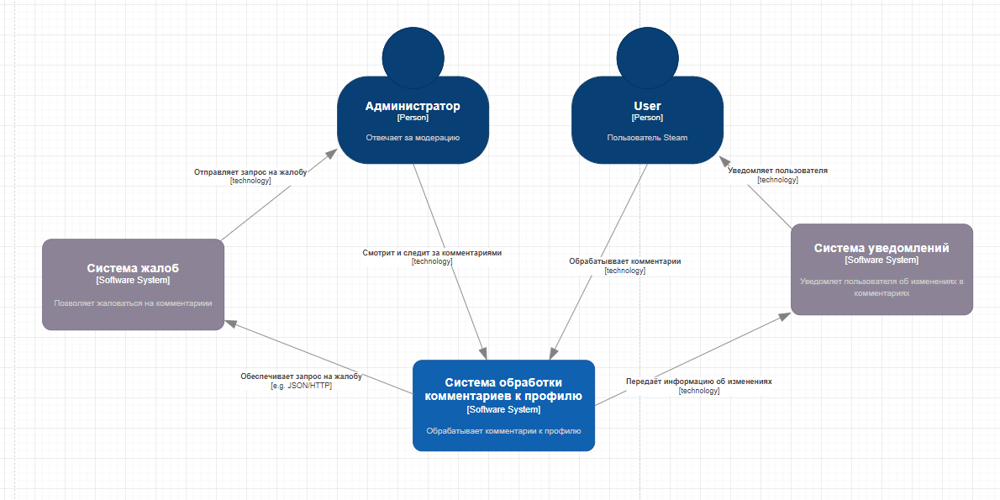
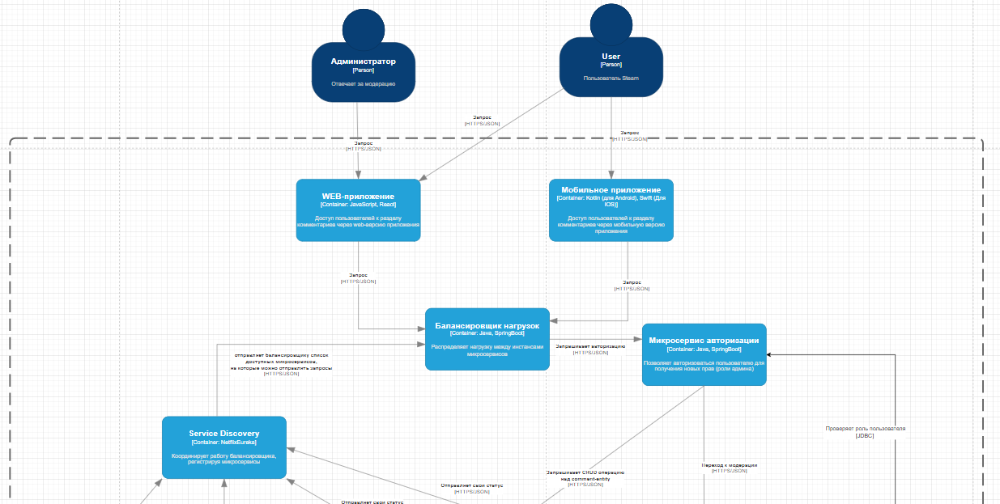
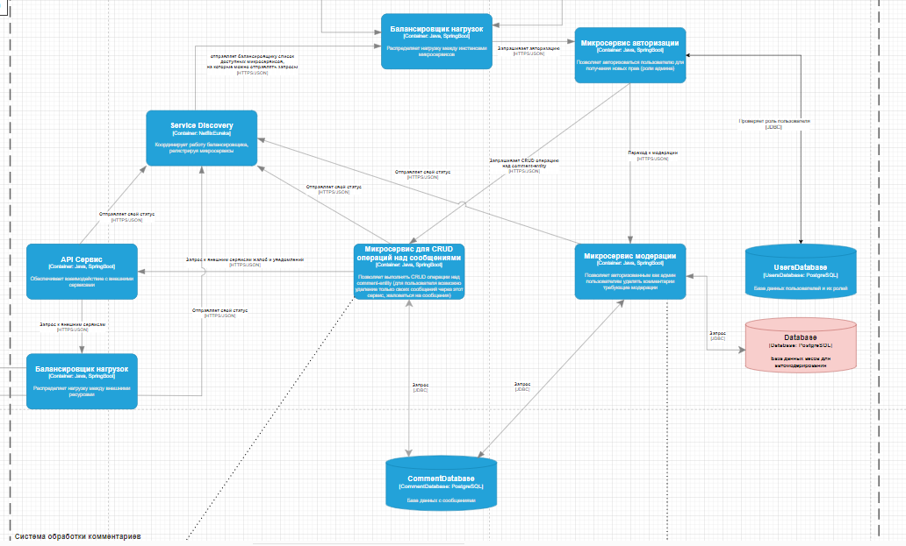
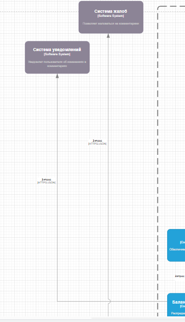
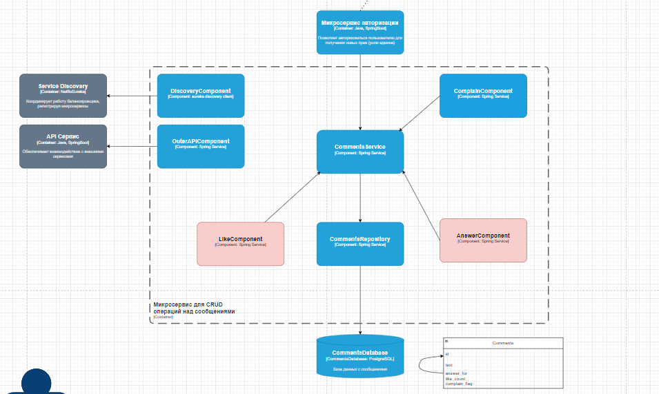
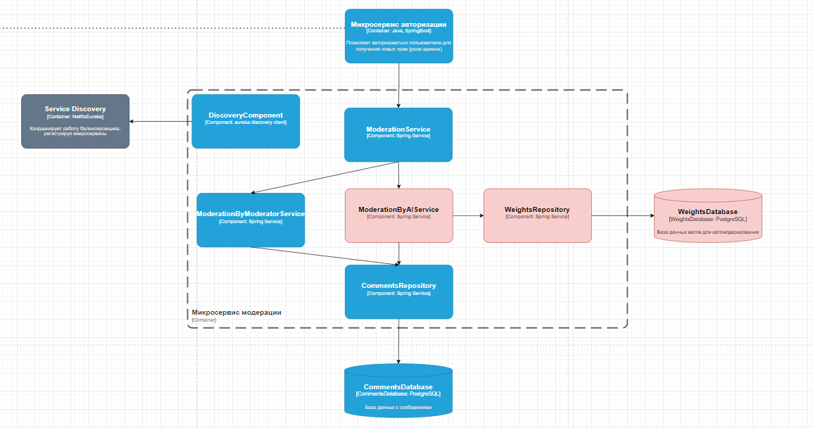
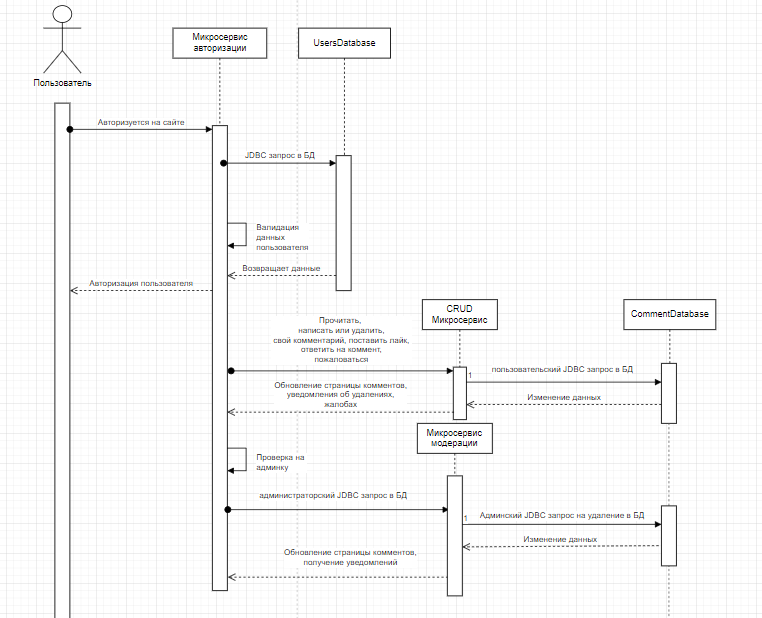
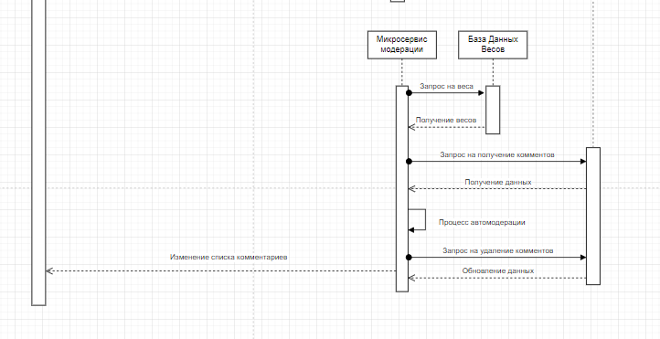

Архитектурные диаграммы функциональных требований по разделам игровой платформы Steam с использованием нотации С4
=====================================================================================

### Команда: <2M / 2A> 
### Студент: Червоников Алексей
### Группа: ML-12

# Summary

Данный докумет объясняет работу функциональностей стим (жёлтые карточки) в разделах Steam (синие карточки). Рассматриваются карточки "комментарии к профилю" и новая функциональность "рейтинг аккаунта". Фичи декомпозированы по уровням С1 (системы) - С2 (контейнеры) - С3 (компоненты). Также добавлены расширения к старой функциональности, о которых будет рассказано в соответсвующем разделе.

# Комментарии к профилю Steam

## 1.1. Бизнес задача

В данном разделе мы проектируем систему комментарий к профилю Steam. В рамках нашей функциональности выполняются базовые функциональные требования такие, как читать, писать, удалять комментарии. Также подразумевается функционал модерации комментариев и отправления жалоб на пользователя, уведомления пользователя об удалении комментария. Именно поэтому в нашей схеме присутствует два участника: User и Administrator. Конечно, можно положить, что реализована система автомодерации комментариев, однако неизвестно как это реализовано на самом деле. В связи с этим, я рассмотрел функционал автомодерации в качестве расширяющего. Помимо в качестве расширяющего представлен функционал лайкания и ответа на комментарии.
Подобный функционал - базовая бизнес-задача при проектировании сетевой части Steam, что позволяет смотреть на платформу, как на огромную социальную сеть пользователей.

## 1.2.	Архитектура решения

Уровень С1 содержит описание взаимодействия Пользователя и Администратора. И пользователь, и администратор могут смотреть, удалять, читать комментарии. Через систему жалоб администратор получает жалобы на комментарии, через систему уведомлений пользователь получает инфу об изменении статуса комментариев. Внутри  блока обработки комментариев реализована основная бизнес-логика, реализованная на уровне С2.

<figure>
  
  <figcaption>Рисунок 1 – уровень С1 для функционала «Комментарии к профилю</figcaption>
</figure>

#
Уровень С2 декомпозирует блок обработки комментариев. Здесь пользователь или администратор обращается к логике фичи с помощью WEB или мобильного приложения. Балансировщик нагрузки распределяет нагрузку между микросервисами, реализующими основную логику функционала и приложениями, поскольку в единицу времени полагается большое число запросов (десятки миллионов пользователей). Всё начинается с микросервиса авторизации, который использует БД о пользователях и их ролях. В зависимости от этого пользователь получает/не получает доступ к модерации комментариев. Так, валидация администратор перенаправляет его запросы к микросервису модерации, меняющему отображение комментариев за счёт удаления слов из соответствующей БД комментов к профилям. Расширяющая особенность заключается в использовании БД весов обученной модели, автоматически удаляемой комментарии из БД. Валидация пользователя даёт возможность запрашивать данные для чтения, записи и написания в БД, за что отвечает логика микросервиса CRUD (Create Read Update Delete). Жалоба реализуется через некое абстрактное флаговое поле в БД. Так же здесь реализованы функциональность лайка и ответа на комментарий (дополнительные поля в БД). Связь запросов с внешними сервисам поддерживается через API системы и прилегающий балансировщик. Контейнер Service Discovery получает запросы от микросервисов о состоянии их работы и выстраивает работу балансировщика исходя из полученной информации.

#
 
  <figcaption>Рисунок 2 – Входной блок диаграммы С2 для комментариев к профилю</figcaption>
</figure>

#
 
  <figcaption>Рисунок 3 – блок бизнес-логики в диаграмме С2</figcaption>
</figure>

#
 
  <figcaption>Рисунок 4 – Блок  связки диаграммы С2  с внешними системами</figcaption>
</figure>

#
Уровень С3 рассматривает декомпозицию контейнеров микросервисов CRUD и модерации на компоненты реализации. Так, чтобы обеспечить заявленный функционал (CRUD) необходимо использование компонент жалобы, лайков, ответа на комментарий и сервиса обработки комментариев. Через соответствующие репозитории они будут связываться БД, выполнять логику и менять содержимое БД. Поскольку компоненты связаны с внешними API и Service Discovery, получаем соответствующие компоненты связок. Обращая внимание, на декомпозицию микросервиса модерации, происходит реализация компоненты ручной модерации. За дополнительные фичи отвечает автомодерация, обращающаяся в весовую БД и реализуюшая логику автоудаления комментария в БД.

#
 
  <figcaption>Рисунок 5 – Диаграмма С3 для CRUD</figcaption>
</figure>

#
 
  <figcaption>Рисунок 6 – Диаграмма С3 для сервиса модерации</figcaption>
</figure>

## 1.3. Сложности и недочёты

На мой взгляд, проблемы решения могут заключаться в следующих особенностях:
1)	Вероятно, стоит распараллелить нагрузку на общую БД комментариев, которая у меня функционирует на два лагеря: обычные пользователи и пользователи-администраторы.
2)	Возможно, стоит учесть момент ложных классификации ML-модели и предусмотреть возможность динамического post-обучения в рамках дополнительного сервиса.
3)	Возможно, стоит пересмотреть как-то логику оформления ответов на комментарии, потому что лично для меня тяжело осознается механизм внутренних ссылок внутри одной БД. Может быть есть смысл иметь дело с реляционными БД, как вариант.

## 1.4. Sequence диаграммы

#
 
  <figcaption>Рисунок 7 – Sequence-диаграмма (часть 1)</figcaption>
</figure>

#
 
  <figcaption>Рисунок 8 – Sequence-диаграмма (часть 2)</figcaption>
</figure>

# 

#	Minimum Viable Product
В принципе, можно выделить следующие этапы:
1)	Продукт «Комментарии к профилю» нужен, чтобы друзья и другие игроки смогли добавить какие-то заметки к профилю игрока, написать дружеские приколы и всё, что душе игрока угодно.
2)	Целевая аудитория – пользователи Steam
3)	Высокий приоритет будет у фичей чтения и написания комментариев. Базовый приоритет у удаления, в последнюю очередь делаем модерацию, жалобы. Необходимо приоритезировать фичи.
4) Спроектировать систему. Например, по С4
5) Разработка
6) Тестирование
