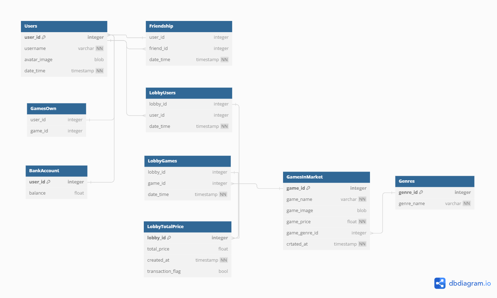

### Базы Данных для раздела "Лотереи" игровой платформы Steam (Новый придуманный функционал)

>Общая архитектура построена на основе ***реляционных баз данных***. Тому могут быть следующие причины:

1. ***Высокая нормализация***: База данных разбита на несколько таблиц, связанных внешними ключами, что обеспечивает высокую степень нормализации. Это минимизирует дублирование данных и улучшает целостность данных.

2. Реляционные базы данных позволяют создавать индексы на столбцах, что значительно ***повышает*** ***производительность*** запросов. Это особенно полезно для больших объемов данных, где необходимо быстро искать записи.

3. ***Совместимость***: Реляционные базы данных совместимы с широким спектром операционных систем и аппаратных платформ.

4. Возможность принимать сложные запросы и получать основную информацию о пользователях, их друзьях, счетах, играх, взаимодействиях и взаимоотношениях между пользователями, текущих лобби и так далее по ***PRIMARY KEY*** или ***ID_{"Вставьте ID того, что вы хотели бы получить"}***. <br>

### Структура Базы Данных

* ***Users*** - Таблица пользователей. Содержит ***основную информацию о пользователях***: ключевое поле user_id, имя пользователя username, данные об аватарке, времени (регистрации или активности, например).
```sql
Table Users
{
  user_id integer [primary key]
  username varchar [not null]
  avatar_image blob [note: "Image of user's avatar"]
  date_time timestamp [default: 'now()', not null]
}
```
* ***Friendship*** - Таблица дружеских взаимосвязей. Содержит ***формат user_id2friend_id***, отражающий дружеское ребро. Так, мы можем получить список друзей, которых хотим добавить в лобби и им отослать уведомления о приглашении. Также по ***friend_id*** можем получить всю основную информацию о друзьях из таблицы ***Users***. (Users where user_id == friend_id or smth like that). Поле date_time - идентификатор времени начала дружбы.

```sql
Table Friendship
{
    user_id integer
    friend_id integer [note: "Friend ID to the User_ID, this table shows the friendship connections"]
    date_time timestamp [default: 'now()', not null]
}
```
* ***LobbyUsers*** - Таблица текущих лобби и пользователей внутри них. После получения списка друзей происходит создание полей типа ***lobby_id*** - ***user_id*** - ***date_time*** (аналогично, временная характеристика). Так мы сможем контроллировать сеанс данного лобби и пользователей внутри этого сеанса.

```sql
Table LobbyUsers
{
  lobby_id integer
  user_id integer
  date_time timestamp [default: 'now()', not null]
}
```

* ***LobbyGames*** - Таблица добавленных в лобби игр. Необходима для генерации выигрыша внутри лобби. Поле ***game_id*** может быть получено как из магазина (БД всех игр), так и на основе ***intersection*** для игр, которые у участников лобби во владении.

```sql
Table LobbyGames
{
  lobby_id integer
  game_id integer
  date_time timestamp [default: 'now()', not null]
} 
```

* ***LobbyTotalPrice*** - Таблица, которая по полю ***lobby_id*** (primary key) добавляет цену, которую надо заплатить для участия в генерации выигрыша (поле ***total_price***). Также есть поле ***transaction_flag***, которое говорит, можно ли начинать генерацию в данном ***lobby_id*** или нет (Успешно ли оплатили участники).

```sql
Table LobbyTotalPrice
{
  lobby_id integer [primary key]
  total_price float [note: "Price for group to pay for roulette spin"]
  created_at timestamp [default: 'now()', not null]
  transaction_flag bool
}
```

* ***GamesInMarket*** - Таблица игр в магазине. Содержит поля game_id, имени, цены, даты релиза, game_genre_id (id жанра), аватарки. Поле ***game_genre_id*** на то и id, чтобы ускорить поиск в случае запроса фильтрации. Поэтому вынесена дополнительная таблица вида ***key-value*** для жанров, чтобы работать не со строками, а с чиселками, что оптимизирует работу с базами данных.

```sql
Table GamesInMarket
{
  game_id integer [primary key]
  game_name varchar [not null]
  game_image blob [note: "Image of game's avatar"]
  game_price float
  game_genre_id integer [note: "Genre_id of game (example, shooter)"]
  crtated_at timestamp [default: 'now()', not null]
}

Table Genres
{
  genre_id integer [primary key]
  genre_name varchar [not null]
}
```

* ***GamesOwn*** - Таблица владения играми. Содержит основную связку ***user_id*** - ***game_id***. Необходима, чтобы добавлять пользователям выигрыш, генерировать игру на основе уже имеющихся и проверять список игр для юзера, чтобы избежать добавления дублей.


```sql
Table GamesOwn
{
  user_id integer
  game_id integer
}
```

* ***BankAccount*** - Таблица балансов. Необходима для проверки возможности транзакции в лобби для юзеров и списания денег в случае подтверждения транзакций. В принципе, понятная таблица.

```sql
Table BankAccount
{
  user_id integer [primary key]
  balance float [note: "Field of balance of user"]
}
```

Визуально База Данных выглядит именно так:



### Рассчёт размера хранимых данных

### Предположения:

1. Число пользователей: 1.000.000
2. Среднее число игр во владении на одного юзера: 6
3. Число дружеских рёбер: 20.000.000 (В реальности может быть куда больше).
4. Число лобби, активных в одну сессию: 1000 (Может и больше в зависимости от спроса на фичу)
5. Среднее число участников на одно лобби: 4
6. Среднее число игр для розыгрыша на одно лобби: 5
7. Число игр в магазине: 100.000
8. Число жанров игр: 25

### Размеры таблиц:

1. ***Users***

* ```user_id ```:  4 байта
* ```username```: 32 байта
* ```avatar_image```: 3072 байта (принимаем 32 х 32 х 3)
* ```date_time```: 8 байт

>На пользователя - 3116 байт <br>
>На всю таблицу - 2,9 ГБ.

2. ***Friendship***

* ```user_id```: 4 байта
* ```friend_id```: 4 байта
* ```date_time```: 8 байт

> На запись - 16 байт <br>
> На всю таблицу - 0.30 ГБ

3. ***LobbyUsers***

* ```lobby_id```: 4 байта
* ```user_id```: 4 байта
* ```date_time```: 8 байт

>На запись - 16 байт <br>
>На таблицу 1000 х 4 х 16 байт = 60 КБ 

4. ***LobbyGames***

* ```lobby_id```: 4 байта
* ```game_id```: 4 байта
* ```date_time```: 8 байт

>На запись - 16 байт<br>
>На таблицу 1000 x 5 x 16 байт = 78.1 КБ

5. ***LobbyTotalPrice***

* ```lobby_id```: 4 байта
* ```total_price```: 4 байта
* ```created_at```: 8 байт
* ```transcation_flag```: 1 байт

>На запись - 17 байт
>На таблицу - 17 х 1000 = 16.6 КБ

6. ***GamesInMarket***

* ```game_id```: 4 байта
* ```game_name```: 32 байта (Пусть max_len = 32)
* ```game_image```:  3072 байта (принимаем 32 х 32 х 3)
* ```game_price```:  4 байта
* ```game_genre_id```: 4 байта
* ```created_at```: 8 байт

>На запись - 3124 байт <br>
>На всю таблицу - 297 МБ

7. ***Genres***
* ```game_genre_id```: 4 байта
* ```game_name```: 16 байта (Пусть max_len = 16)

>На запись - 20 байт <br>
>На всю таблицу - 500 байт

8. ***GamesOwn***
* ```user_id```: 4 байта
* ```game_id```: 4 байта

>На запись - 8 байт <br>
> На всю таблицу 6 x 1.000.000 x 8 = 48 МБ

9. ***BankAccount***

* ```user_id```: 4 байта
* ```balance```: 4 байта

>На запись - 8 байт <br>
> На всю таблицу 8 x 1.000.000 = 8 МБ

> ***Итого***: 0.30 + 2.9 + 0.353 + копейки $\approx$ 3.56 ГБ